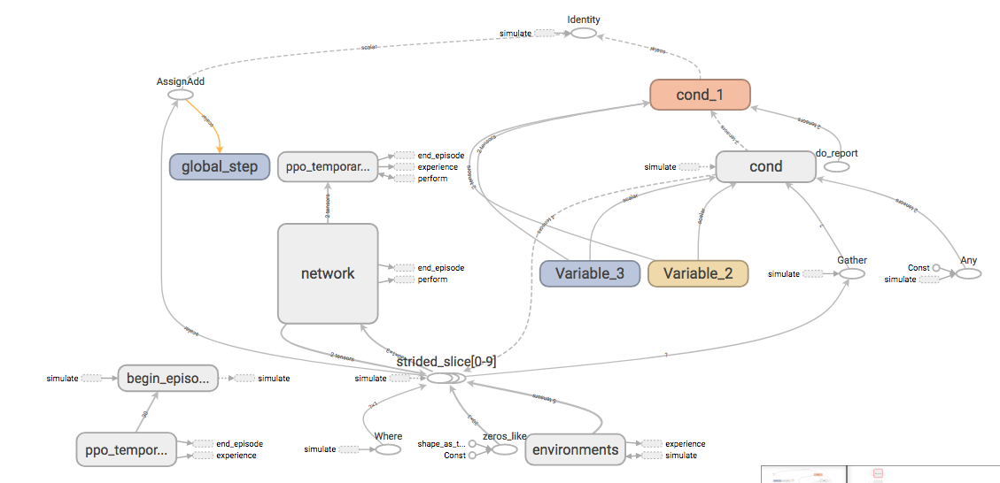
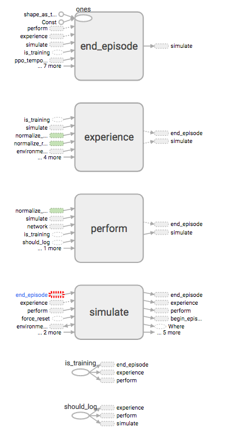
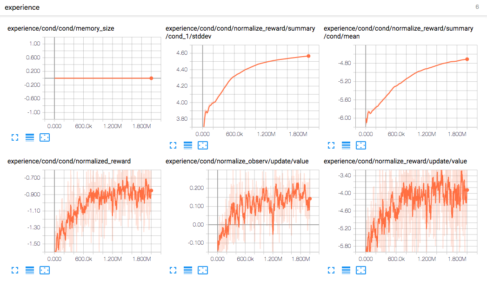
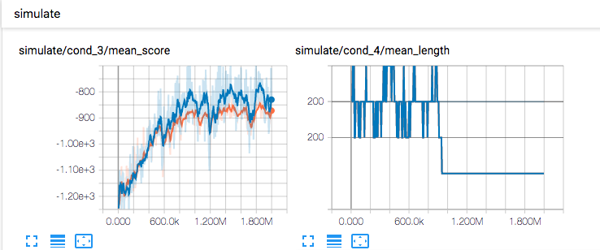

# PPO agents

## 実行方法

```bash
$python -m agents.scripts.train --logdir=./logdir --config=pendulum
$python -m agents.scripts.visualize --logdir=/path/to/logdir/<time>-<config> --outdir=/path/to/outdir/
```

## 概要





|ファイル|内容|
|:----|:--|
|configs.py|タスクやアルゴリズムを特定する実験configurations|
|networks.py|ニューラルネットワークモデル|
|train.py|学習セットアップを含む実行可能ファイル|
|ppo/ppo.py|PPOアルゴリズムのTensorFlowグラフ|

以下の用意されたインターフェースによって、OpenAIのgymをより効率的にアルゴリズムの実装できるように統合されている。

- **agents.tools.wrappers.ExternalProcess**はOpenAI Gym環境の外部プロセスの内側を構築してくれる環境ラッパー。`steps()`と`reset()`をアトリビュート(属性)アクセスとして呼べ、プロセスへおくられ結果を待つ。これはPythonのglobal interpreter lockによって制限されないでマルチ環境の実行を許す。
- **agents.tools.BatchEnv**は複数のOpenAI Gymの環境をバッチとして捉えれるインターフェースになっている。`step()`を行動のバッチで呼ぶと、観測、報酬、情報等のバッチが与えられる。`個々の環境が外部プロセスに存在する場合、それらは並行してステップされる(??)`
- **agents.tools.InGraphBatchEnv**はTensorFlowのグラフに統合され、`step(), reset()`がオペレーションとして作られる。現在の観測、最後の行動、報酬や端末フラグのバッチ、はtensorとして入手可能で、`tf.Variable`にsotreされる
- **agents.tools.simulate()**は`in-graph`バッチ環境のステップと強化学習を一つのオペレーションに融合し、学習ループの内部で呼べるようにする。これにより、`tf.Session`のコールの数が減らせる

## Tools

### tools.mock_environment.py

実装した。一言でいうと、まさにOpenAI Gymの型にハマった環境のモックだった。`step()`と`reset()`が用意されている。

`duration`は期間という意味で、`n[duration] = n[steps] / [episode]`という感じ。勉強になったことといえば、durationが「大体これぐらいの長さ(step)だったらいいな」に対して、stepsは「実際この長さ(stepの)だった」というもの。    
なので、モックの場合はdurations[-1]決定的で、steps[-1]は単調増加してdurations[-1]を超過すれば`done`する

### tools.mock_algorithm.py

実装した。`perform()`, `experience()`, `end_episode()`がなかなか意味深。なんとなくではあるけど、TensorBoardをみる限り

#### 学習時




#### 評価(eval)時




----

TensorBoardの`DISTRIBUTIONS, HISTGRAM`を見るとある程度わかる。

**perform**は、行動、対数確率、モード、偏差を実行し、監視してる


いや、やっぱりよくわからん。**！！！！これらのメソッドの流れをしっかり理解する！！！！**はい

### tools.AttrDict

これは正直わかりやすい。dict()を改良したもので属性としてKeyにアクセスできて、lock機能がある。withでunlockしてからじゃないとアクセスできない。immutableというはず。なぜこんなものが必要なのかよくわからん

### tools.batch_env

### tools.count_weights

用途は正直イマイチわかっていない。しかしやっていることは明確で、すべての重みの数を数え上げている。

勉強になったのは、`import re`から、`.match`したものは除外するというプログラムだ。    
あと、ニューラルネットワークのモデルの定義を`with tf.name_scope`内で書いても、`x.name`には反映されてない。    
モデル名に反映させたかったら、`tf.variable_scope`を使わないといけないっぽい

### tools.in_graph_batch_env

### tools.in_graph_env

`InGrapEnv`を実装した。このクラスはこの`agents`ライブラリで全く使われていない。念のため、テストを書いた。

このクラスは、`tf.Variable`で観測、報酬、端末フラグを管理しており、端的に言えば`gym.Env`のラッパーである。   
`simulate()`が環境の更新関数なのかな。`gym.Env.step`に似ている。違いは、`simulate()`はTensorFlow仕様になっているから、`assign`を使っている。`self._step`というクラス変数があるけど、これは`global_step`に近い変数で、このインスタンスが何step目かを管理している

ちょっとわからないのだけど、`self.step`は`self.reset()`しても`0`が代入されていない。

勉強になったのは、Attributorの使い方である。これは、`__getattr__(self, name)`からGymのenvに直接アクセスしてる。   
他には管理している変数の名前空間は`environment`であるのに対して、`simulate()`の中では、`environment/simulate`という名前空間を使っている。    
型がいっぱいあって、担保しきれない場合は、`raise NotImplementError()`と呼ぶ。

```python
      observ, reward, done = tf.py_func(
          lambda a: self._env.step(a)[:3], [action],
          [observ_dtype, tf.float32, tf.bool], name='step')
```

この書き方は普通に勉強になるかなあ。

```python
      if action.dtype in (tf.float16, tf.float32, tf.float64):
        action = tf.check_numerics(action, 'action')
```

みたいに、どういう値がAgent側で担保しない場合は、環境が担保する。

### tools.loop

### tools.nested

### tools.simulate

### tools.streaming_mean

### tools.wrappers