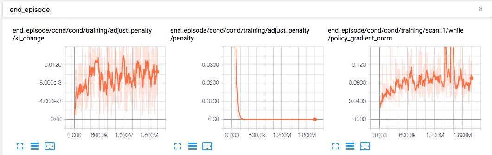

# PPO agents

## 実行方法

```bash
$python -m agents.scripts.train --logdir=./logdir --config=pendulum
$python -m agents.scripts.visualize --logdir=/path/to/logdir/<time>-<config> --outdir=/path/to/outdir/
```

## 概要

|ファイル|内容|
|:----|:--|
|configs.py|タスクやアルゴリズムを特定する実験configurations|
|networks.py|ニューラルネットワークモデル|
|train.py|学習セットアップを含む実行可能ファイル|
|ppo/ppo.py|PPOアルゴリズムのTensorFlowグラフ|

以下の用意されたインターフェースによって、OpenAIのgymをより効率的にアルゴリズムの実装できるように統合されている。

- **agents.tools.wrappers.ExternalProcess**はOpenAI Gym環境の外部プロセスの内側を構築してくれる環境ラッパー。`steps()`と`reset()`をアトリビュート(属性)アクセスとして呼べ、プロセスへおくられ結果を待つ。これはPythonのglobal interpreter lockによって制限されないでマルチ環境の実行を許す。
- **agents.tools.BatchEnv**は複数のOpenAI Gymの環境をバッチとして捉えれるインターフェースになっている。`step()`を行動のバッチで呼ぶと、観測、報酬、情報等のバッチが与えられる。`個々の環境が外部プロセスに存在する場合、それらは並行してステップされる(??)`
- **agents.tools.InGraphBatchEnv**はTensorFlowのグラフに統合され、`step(), reset()`がオペレーションとして作られる。現在の観測、最後の行動、報酬や端末フラグのバッチ、はtensorとして入手可能で、`tf.Variable`にsotreされる
- **agents.tools.simulate()**は`in-graph`バッチ環境のステップと強化学習を一つのオペレーションに融合し、学習ループの内部で呼べるようにする。これにより、`tf.Session`のコールの数が減らせる

## Tools

### tools.mock_environment.py

実装した。一言でいうと、まさにOpenAI Gymの型にハマった環境のモックだった。`step()`と`reset()`が用意されている。

`duration`は期間という意味で、`n[duration] = n[steps] / [episode]`という感じ。勉強になったことといえば、durationが「大体これぐらいの長さ(step)だったらいいな」に対して、stepsは「実際この長さ(stepの)だった」というもの。    
なので、モックの場合はdurations[-1]決定的で、steps[-1]は単調増加してdurations[-1]を超過すれば`done`する

### tools.mock_algorithm.py

実装した。`perform()`, `experience()`, `end_episode()`がなかなか意味深。なんとなくではあるけど、TensorBoardをみる限り

#### 学習時




#### 評価(eval)時


----

TensorBoardの`DISTRIBUTIONS, HISTGRAM`を見るとある程度わかる。

**perform**は、行動、対数確率、モード、偏差を実行し、監視してる


いや、やっぱりよくわからん。**！！！！これらのメソッドの流れをしっかり理解する！！！！**はい

### tools.AttrDict

これは正直わかりやすい。dict()を改良したもので属性としてKeyにアクセスできて、lock機能がある。withでunlockしてからじゃないとアクセスできない。immutableというはず。なぜこんなものが必要なのかよくわからん